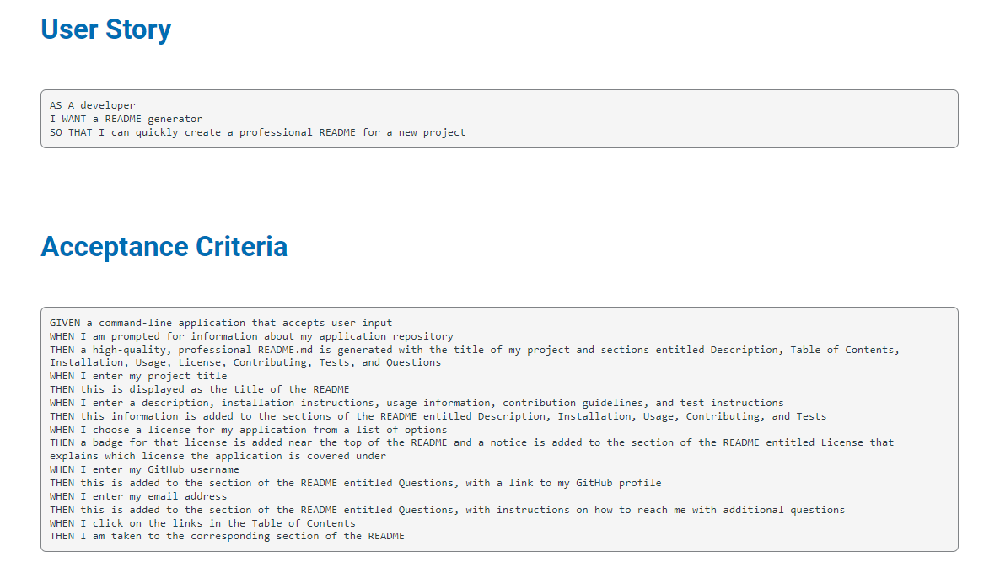

## Node.js Challenge: Professional README Generator

 

### Project Mock-up

### Current Project State

* [Project-state](https://github.com/MiguelJerome/code-quiiz-dom/issues)

### Project Ressources

* node-modules
        - [node-modules](./node_modules/)
* json
        - [package](package.json)
        - [package-lock](package-lock.json)

## Professional README Generator

This is my Professional README Generator website [link](https://migueljerome.github.io/Professional-Generator/) 
You can have access to the ressources of my Professional README Generator Web Page [this the link](https://github.com/MiguelJerome/Professional-Generator) 

 ## Local launch on chrome browser
 [local-chrome](http://127.0.0.1:5501)